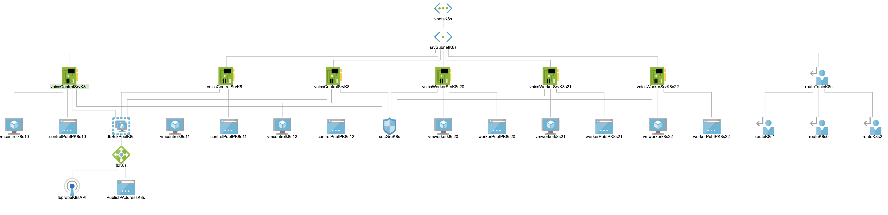

# azure-k8s
This is based on Ivan Fioravanti's [Kubernetes the hard way on azure](https://github.com/ivanfioravanti/kubernetes-the-hard-way-on-azure) which is a fork of the great [Kubernetes The Hard Way](https://github.com/kelseyhightower/kubernetes-the-hard-way) from [Kelsey Hightower](https://twitter.com/kelseyhightower).  
  
Thanks to both of them!!!  

  


  
## Steps   
* get kubectl, cfssl and cfssljson
  * kubectl
  * cfssl, cfssljson
* get an azure subs one and [do this](https://docs.microsoft.com/en-us/azure/virtual-machines/linux/terraform-install-configure) for getting terraform to work with azure  
If you are only missing the service principal...
```
# set the subscription
me@Azure:~$ az account set --subscription="${SUBSCRIPTION_ID}"
# create service principal
me@Azure:~$ az ad sp create-for-rbac --name terraform-tests --role="Contributor" --scopes="/subscriptions/${SUBSCRIPTION_ID}"

```


* create terraform.tfvars in the root of azure-k8s:
```
subscription_id = "<azure subscription id>"
client_id       = "<azure client id>"
client_secret   = "<azure client secret>"
tenant_id       = "<azure tenant id>"

environment_tag  = "Terraform k8s"
location         = "westeurope"
k8s_cluster_name = "kubernetes-the-hard-way"

# for now must be from 0 to n with increments of 1
control_ids    = [0, 1, 2]
worker_ids     = [0, 1, 2]
address_spaces = ["10.0.31.0/24"]
subnets = [
  {
    "name"   = "srvSubnetK8s"
    "prefix" = "10.0.31.0/24"
  }
]

# cidr for the pods
podCIDR         = "10.200.0.0/16"

# starting ip within the subnet prefix
# the first subnet in subnets is assumed
control_base_ip = 10
worker_base_ip  = 20

# generate this ssh keys (user k8s)
ssh_pub_key     = "./k8s_key.pub"
ssh_priv_key    = "./k8s_key"

# hostnames will start with...
control_prefix  = "controlk8s"
worker_prefix   = "workerk8s"
```
* terraform init
* terraform apply -auto-approve
* do your tests - notice the output of the last steps because some tests are being done and you have to do some manual steps to connect to the dashboard
* terraform destroy -auto-approve